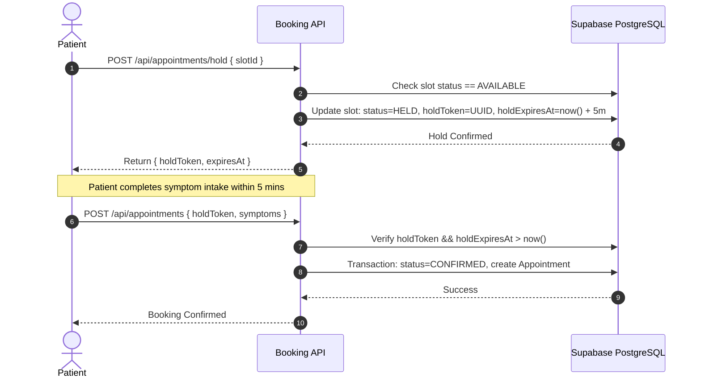
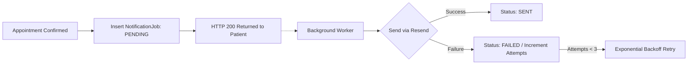

# Clinix Healthcare Platform — System Design Document

**Author:** Ayush Kumar  
**Version:** 1.0.0 | Production Architecture  
**Scope:** Concurrency Controls, Schedule Conflict Resolution, Slot Locking, and Notification Fault Tolerance  

---

## 1. Concurrency-Safe Double-Booking Prevention

In clinical scheduling, race conditions occur when two patients concurrently attempt to book the exact same time slot for a physician. Clinix solves this through a multi-layered defense combining relational database constraints and transactional isolation.

### Architectural Solution
1. **Compound Unique Index:** The PostgreSQL database enforces a hard constraint at the storage engine layer:
   ```sql
   CREATE UNIQUE INDEX "AppointmentSlot_doctorId_date_startTime_key" 
   ON "AppointmentSlot"("doctorId", "date", "startTime");
   ```
2. **ACID Serializable Transactions:** Slot confirmation and appointment record creation execute within an atomic `prisma.$transaction()` block.
3. **Pessimistic State Transitions:** When a confirmation request arrives:
   - The slot is retrieved with status `AVAILABLE` or verified against the patient's active `holdToken`.
   - The slot status transitions to `CONFIRMED`.
   - If a competing request attempts to confirm or insert against the same `(doctorId, date, startTime)` tuple, the database immediately throws a unique key violation (`P2002`).
   - Clinix traps this error and returns a clean HTTP 409 `SLOT_ALREADY_BOOKED` response without corrupting data or leaving orphan records.

---

## 2. 5-Minute Slot Hold Engine (Temporary Locking)

To prevent competing users from selecting the same time slot while completing the multi-step symptom intake and AI screening, Clinix implements a time-bounded hold mechanism.



### Expiration & Cleanup
- **Token Verification:** When finalizing a booking, the API validates that the provided `holdToken` matches the database record and `holdExpiresAt > new Date()`.
- **Lazy Eviction:** Slot availability queries dynamically treat any slot where `status == 'HELD'` and `holdExpiresAt <= now()` as `AVAILABLE`, automatically resetting stale tokens during read passes without requiring persistent Redis keys.

---

## 3. Doctor Leave Conflict Handling & Resolution

When physicians schedule emergency or planned leaves, booked appointments must be audited and resolved without administrative chaos.

### Resolution Protocol
1. **Live Conflict Audit (`previewOnly: true`):** When a doctor or admin selects a leave date, the system queries:
   ```typescript
   prisma.appointment.findMany({
     where: { doctorId, date: leaveDate, status: { in: ['UPCOMING', 'RESCHEDULED'] } }
   });
   ```
   The UI immediately alerts the user with the count and roster of impacted patients.
2. **Atomic Conflict Resolution:**
   - The `DoctorLeave` record is persisted via `upsert`.
   - All conflicting appointments are updated to `CANCELLED`.
   - All associated `AppointmentSlot` records are released with cleared hold tokens.
3. **Asynchronous Non-Blocking Dispatch:**
   - For every cancelled appointment, a `DOCTOR_LEAVE` email job is placed in the notification queue.
   - Associated Google Calendar events are deleted via Google Calendar API without blocking the HTTP request.

---

## 4. Fault-Tolerant Notification Queue

External email delivery (Resend API) and OAuth integrations (Google Calendar) are external network dependencies that must never jeopardize core transaction atomicity.



### Architectural Guarantees
- **Decoupled Job Queue:** Email jobs are written to the `NotificationJob` table within the primary database transaction.
- **Worker Isolation:** The background worker (`processNotificationQueue`) fetches pending jobs, invokes the Resend SDK, and logs errors in `lastError` with `attempts` counters.
- **Fail-Safe Operation:** If the Resend API rate limits or experiences downtime, the appointment booking remains 100% intact. Scheduled cron jobs (`/api/cron/process-notifications`) retry pending jobs with exponential backoff up to 3 attempts.
